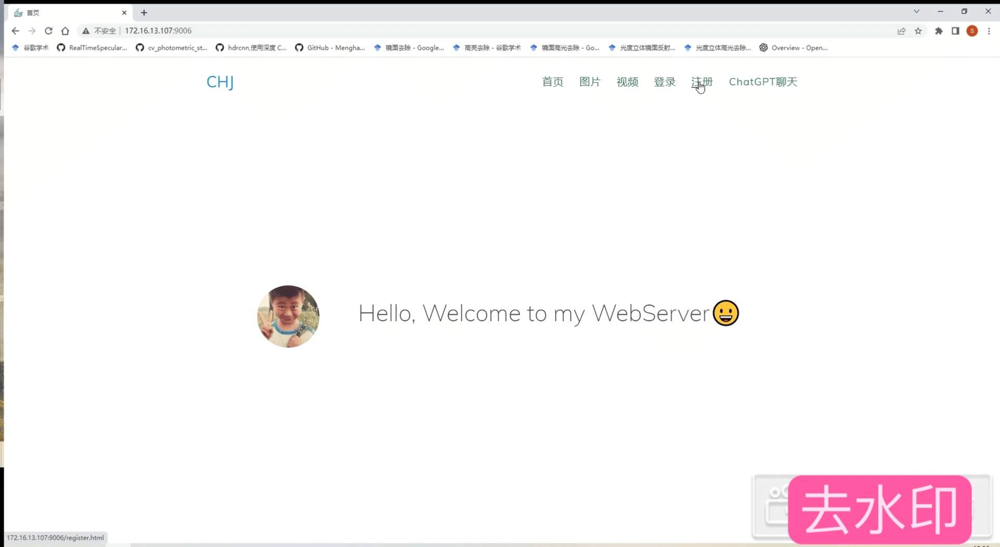

# WebServer with ChatGPT

本项目是在Linux下搭建的轻量级Web服务器

- 优化了前端资源，采用LiteWebChat框架并基于gpt-3.5-turbo API配置了**ChatGPT聊天服务资源**
- 通过 MJPEG-Streamer 获取的摄像头实时画面嵌入到客户端网页上
- 使用**线程池**+**非阻塞socket**+**epoll**实现高并发的**模拟proactor模式**以及**reactor模式**
- 使用**有限状态机**+**正则表达式**解析HTTP请求报文，实现了**GET**和**POST**的解析
- 利用**单例模式**和**原子操作**实现了**无锁**的日志系统，记录服务器运行状态
- **可访问数据库，实现了登录和注册功能**
- 实现结构为**升序链表**的定时器，关闭超时的非活动连接
- 经过Webbench压力测试，**可实现上万并发**

# 演示

## 首页


## 登录和注册



## 请求图片资源


## 请求视频资源


## ChatGPT功能


# 环境要求

- Linux
- C++11

# 项目启动

- 测试前确认已安装MySQL数据库

  ```
  // 建立yourdb库
  create database yourdb;
  
  // 创建user表
  USE yourdb;
  CREATE TABLE user(
      username char(50) NULL,
      passwd char(50) NULL
  )ENGINE=InnoDB;
  
  // 添加数据
  INSERT INTO user(username, passwd) VALUES('name', 'passwd');
  ```

- 修改main.cpp中的数据库初始化信息

  ```
  //数据库登录名,密码,库名
  string user = "root";
  string passwd = "root";
  string databasename = "yourdb";
  ```

- build

  ```
  make
  ```

- 启动server

  ```
  ./server
  ```

- 浏览器端

  ```
  ip:9006
  ```

# 致谢

Linux高性能服务器编程，游双著。

[@markparticle](https://github.com/markparticle/WebServer/)，[@MorFansLab](https://github.com/MorFansLab/LiteWebChat_Frame)，[@TinyWeb](https://github.com/qinguoyi/TinyWebServer)

